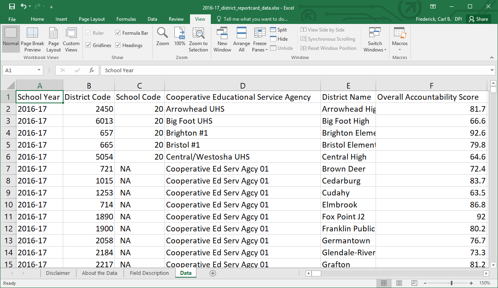
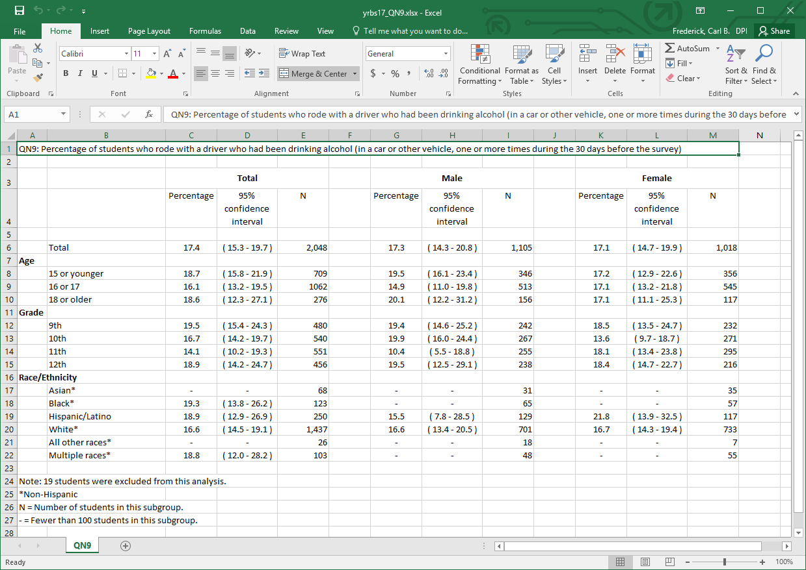

```{r setup, include=FALSE}
knitr::opts_chunk$set(echo = TRUE)

library(tidyverse)
library(emo)
```

## Working with others = Working with Excel 
<style>
  .twocolumns {
    columns: 2 200px;         /* number of columns and width in pixels*/
    -webkit-columns: 2 200px; /* chrome, safari */
    -moz-columns: 2 200px;    /* firefox */
  }
</style>
 
<div class="twocolumns">


**Agenda**

 1. Review a list of R packages that interact with Excel
 
 2. Focus on strategies for working with spreadsheets that are optimized for 
    human readability instead of machine readability.
    
**Goal**

*You will remember there is a way to do this in R and this presentation can 
be a reference/recipe when you need it.*
    
</div>

## R packages that interact with Excel

The R-Data Import/Export Manual has a "[chapter]()" about interacting with 
Excel. 

>"The first piece of advice is to avoid doing so if possible!"

Instead, they suggest opening the spreadsheet, saving as a .csv or similar, 
and then reading in the .csv file.  

Undeterred, I searched CRAN for excel and these are the packages that popped up:

```{r pkg-list, echo=FALSE}
data_frame(
  `Package Name` = c("[`excel.link`](https://cran.r-project.org/web/packages/excel.link/)",
                     "[`readxl`](https://readxl.tidyverse.org/)",
                     "[`xlsx`](https://cran.r-project.org/web/packages/xlsx/)",
                     "[`XLConnect`](https://cran.r-project.org/web/packages/XLConnect/)",
                     "[`openxlsx`](https://cran.r-project.org/web/packages/openxlsx/)",
                     "[`tidyxl`](https://cran.r-project.org/web/packages/tidyxl/)",
                     "[`WriteXLS`](https://cran.r-project.org/web/packages/WriteXLS/)",
                     "[`writexl`](https://cran.r-project.org/web/packages/writexl/)",
                     "[`tatoo`](https://cran.r-project.org/web/packages/tatoo/)",
                     "[`dataframes2xls`](https://cran.r-project.org/web/packages/dataframes2xls/)"),
  
  Reads  = c(emo::ji("check"), 
             emo::ji("check"), 
             emo::ji("check"), 
             emo::ji("check"), 
             emo::ji("check"), 
             emo::ji("check"),
             "",
             "",
             "",
             ""),
  
  Writes = c(emo::ji("check"), 
             "", 
             emo::ji("check"), 
             emo::ji("check"), 
             emo::ji("check"), 
             "", 
             emo::ji("check"), 
             emo::ji("check"), 
             emo::ji("check"), 
             emo::ji("check")),
  
  Notes = c("Haven't used. Can write .xslb and password protected files.",
            "Lightweight, best for straightforward inputs.",
            "Heavy duty, can even format worksheets ... everything but graphics (Java dependency).",
            "This one can even do graphics (Java dependency).",
            "Full function, without Java dependency.",
            "Designed to import human-optimized sheets.",
            "Haven't used.",
            "Haven't used. Appears to be complement to readxl",
            "Haven't used. For Excel reports from R with metadata.",
            "Haven't used.")
) %>% 
  mutate(
    faves = if_else(str_extract(`Package Name`, "\\[[`A-z0-9\\.]*\\]") %in% c("[`readxl`]", "[`openxlsx`]", "[`tidyxl`]"),
                    0L, 1L),
    notUsed = if_else(grepl("Haven't used.", Notes), 1L, 0L),
    Notes = trimws(gsub("Haven't used.", "", Notes, fixed = TRUE), "both")
  ) %>% 
  arrange(faves, notUsed, `Package Name`) %>% 
  select(-faves, -notUsed) %>% 
  knitr::kable(align = c("l", "c", "c"), format = "html") %>% 
  kableExtra::kable_styling(c("striped", "condensed"), full_width = FALSE) %>% 
  kableExtra::group_rows("My Go-To Packages", 1, 3) %>%   
  kableExtra::group_rows("Others I've Used", 4, 5) %>% 
  kableExtra::group_rows("Haven't Used", 6, 10) 
```

## Import from Excel: Machine Friendly Files 

Machine friendly files with variables in columns and observations in rows. 
Ideally, they have variable names in the top row. 

*e.g. [2016-17 District Accountability Report Cards](https://apps2.dpi.wi.gov/reportcards/)*

```{r}
#Download the file
tdir <- tempdir()
fname <- file.path(tdir, "ReportCard_Dist_1617.xlsx")
curl::curl_download(url = "http://dpi.wi.gov/sites/default/files/imce/accountability/xls/2016-17_district_reportcard_data.xlsx", 
              destfile = fname)
```



## Basic Import: `readxl`

```{r}
#Using readxl
library(readxl)

#Check Sheet Names
excel_sheets(fname)

#Import Data
read_excel(path = fname, sheet = "Data") %>% head(10)
```

## Basic Import: `openxlsx`

```{r}
#Using openxlsx
library(openxlsx)

#Check Sheet Names
getSheetNames(fname)

#Import Data
read.xlsx(xlsxFile = fname, sheet = "Data") %>% head(10)
```

## `readxl` vs `openxlsx`

```{r, echo = FALSE}
tribble(
  ~char,                                   ~readxl,        ~openxlsx,         ~notes,
  "Returns (object type)",                 "tibble",       "data.frame",      "",
  "Skip rows at the top",                  "skip",         "startRow",        "Both automatically skip empty rows at top.",
  "Treat 1st row as column names",         "col_names",    "colNames",        "With `readxl` you can also specify new column names.",
  "Strings to interpret as NAs'",          "na",           "na.strings",      "Both treat blank cells as NA's",
  "Specify rows and/or columns to import", "range, nmax",  "rows, cols",      "",
  "Tell R the variable types",             "col_types",    "detectDates",     "`readxl` offers wider range of variable types",
  "# values to read to guess column type", "guess_max",     emo::ji('x'),    "",
  "Delete leading/trailing whitespace",    "trim_ws",       emo::ji('x'),    "",
  "Treat 1st column as row names",         emo::ji('x'),  "rowNames",        "",
  "Skip empty rows in middle of data",     emo::ji('x'),  "skipEmptyRows",   "",
  "Skip empty columns in middle of data",  emo::ji('x'),  "skipEmptyCols",   "",
  "Ensure column names are valid R names", emo::ji('x'),  "check.names",     "",
  "Import only a named region in .xlsx",   emo::ji('x'),  "namedRegion",     "",
  "How to import merged cells",            emo::ji('x'),  "fillMergedCells", ""
  
) %>% 
  knitr::kable(align = c("l", "c", "c", "l"), col.names = c("", "`readxl`", "`openxlsx`", "Notes")) %>% 
  kableExtra::kable_styling(c("striped", "condensed"), full_width = FALSE) %>% 
  kableExtra::group_rows("Arguments in Common", 2, 4) %>% 
  kableExtra::group_rows("Arguments that do similar things", 5, 6)  %>% 
  kableExtra::group_rows("Unique to `readxl`", 7, 8)   %>% 
  kableExtra::group_rows("Unique to `openxlsx`", 9, 14) 
  

```

## Import from Excel: Human Friendly Files

Couldn't find a good example on our public download page ( 
`r paste(emo::ji("nerd_face"), emo::ji("thumbs_up"), emo::ji("fireworks"))`). 

I know I have some that aren't on the website, though. There is nothing wrong 
with this, but just hard to work with.

Instead, I will use the nicely formated [YRBS 2017 summary tables](https://dpi.wi.gov/sites/default/files/imce/sspw/pdf/yrbs17summarytables.pdf) 
and pretend they exist in an Excel document.



## Enter: `tidyxl`

What I want:

```{r, echo = FALSE}
data_frame(
  subgrp1 = c("Total", "Total", "Total", "Total", "Total"),
  subgrp2 = c("Total", "15 or younger", "16-17", "18 or Older", "9th Grade"),
  denominator = c(2048, 709, 1062, 276, 480),
  pct = c(17.4, 18.7, 16.1, 18.6, 19.5),
  ci95 = c("(15.3-19.7)", "(15.8-21.9)", "(13.2-19.25)", "(12.3-27.1)", "(15.4-24.3)")
) %>% 
  knitr::kable(.) %>% 
  kableExtra::kable_styling(c("striped", "condensed"), full_width = FALSE)
```

## Import cells `xlsx_cells()`

```{r, message = FALSE, warning = FALSE}
library(tidyxl)
yrbs17 <- xlsx_cells("yrbs17_QN9.xlsx", 
                     sheets = "QN9",
                     check_filetype = TRUE,
                     include_blank_cells = FALSE)
yrbs17

#The cell values are in the 'character' column
yrbs17$character[1:10]

#Cell formatting info is a tibble in the 'character_formatted' column
yrbs17$character_formatted[[1]]
```


## Writing .xlsx files from R

openxlsx example for one, then many sheets per file

## Other packages related to Excel

* Packages with convenience functions related to Excel
  + [rio](https://cran.r-project.org/web/packages/rio/) package for general 
    data import/export across formats, includes wrappers for `readxl` and 
    `openxlsx` functions
  + [xlsimple](https://cran.r-project.org/web/packages/xlsimple/xlsimple.pdf) 
    wrappers for use with `XLConnect`
  + [table1xls](https://cran.r-project.org/web/packages/table1xls/) wrappers
    for use with `XLConnect` to make summary tables common to scientific 
    articles
  + [xltabr](https://cran.r-project.org/web/packages/xltabr/) wrappers for
    `openxlsx` that write "beautifully formatted cross-tabulations" to Excel
  + [joinXL](https://cran.r-project.org/web/packages/joinXL/) uses `readxl`
    and `openxlsx` to perform SQL like joins on Excel files
  + [tablaxlsx](https://cran.r-project.org/web/packages/tablaxlsx/) wrappers
    to write formatted tables to Excel

* Non-Excel focused packages that import from Excel
  + [datapasta](https://cran.r-project.org/web/packages/datapasta/) copy-paste
    data from Excel into an R data.frame

* Non-Excel focused packages that export to Excel
  + [basictabler](https://cran.r-project.org/web/packages/basictabler/) 
    constructs rich tables for output to html or Excel
  + [pivottabler](https://cran.r-project.org/web/packages/pivottabler/)
    create basic or complex pivot tables in R with output to Excel
  + [pdftables](https://cran.r-project.org/web/packages/pdftables/) converts
    tables in pdf documents, .xlsx is one of the possible formats

* [BERT](https://bert-toolkit.com/) is kind of the opposite of the focus of 
  this presentation ... it is a designed to 
  + support running R functions from Excel spreadsheet cells
  + control Excel in real time from your R code
    

## Have non-Excel spreadsheets?

There are also packages that interact with:

* Google Sheets: [googlesheets](https://github.com/jennybc/googlesheets)
* ODS (open document spreadsheets): [readODS](https://github.com/chainsawriot/readODS)

## session_info()
```{r}
devtools::session_info()
```

