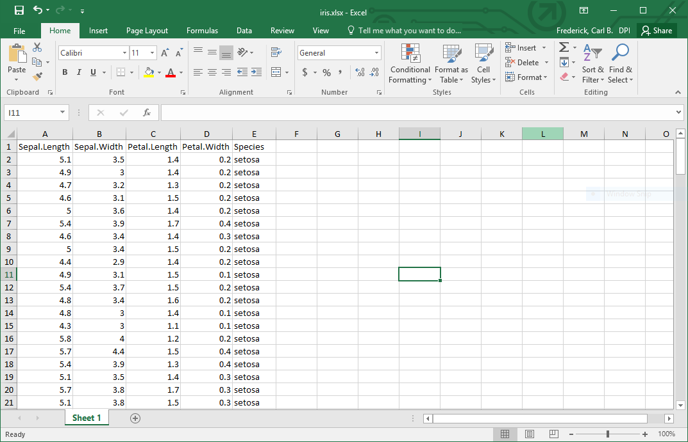
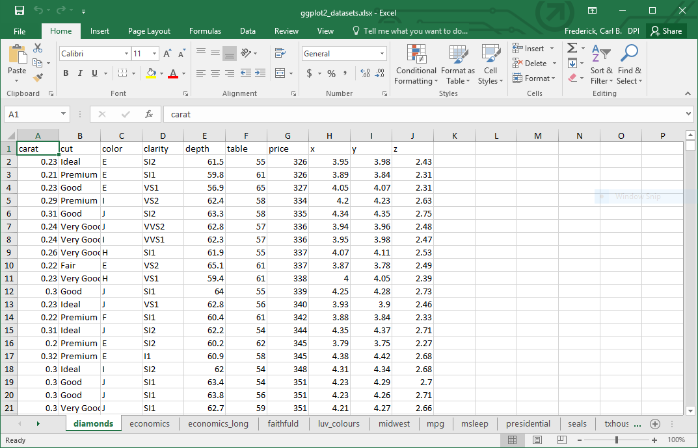

```{r setup, include=FALSE}
knitr::opts_chunk$set(echo = TRUE)

library(tidyverse)
library(emo)
```

## Working with others = Working with Excel 
<style>
  .twocolumns {
    columns: 2 200px;         /* number of columns and width in pixels*/
    -webkit-columns: 2 200px; /* chrome, safari */
    -moz-columns: 2 200px;    /* firefox */
  }
</style>
 
<div class="twocolumns">


**Agenda**

 1. Review a list of R packages that interact with Excel
 
 2. Focus on strategies for working with spreadsheets that are optimized for 
    human readability instead of machine readability.
    
<div style = "background-color: lightblue">    
**Goal**

*You will remember there is a way to do this in R and this presentation can 
be a reference/recipe when you need it.*
</div>
    
</div>

## R packages that interact with Excel

The R-Data Import/Export Manual has a "[chapter](https://cran.r-project.org/doc/manuals/r-release/R-data.html#Reading-Excel-spreadsheets)" 
about interacting with Excel. 

>"The first piece of advice is to avoid doing so if possible!"

Instead, they suggest opening the spreadsheet, saving as a .csv or similar, 
and then reading in the .csv file.  

Undeterred, I searched CRAN for excel and these are the packages that popped up:

```{r pkg-list, echo=FALSE}
data_frame(
  `Package Name` = c("[`excel.link`](https://cran.r-project.org/web/packages/excel.link/)",
                     "[`readxl`](https://readxl.tidyverse.org/)",
                     "[`xlsx`](https://cran.r-project.org/web/packages/xlsx/)",
                     "[`XLConnect`](https://cran.r-project.org/web/packages/XLConnect/)",
                     "[`openxlsx`](https://cran.r-project.org/web/packages/openxlsx/)",
                     "[`tidyxl`](https://cran.r-project.org/web/packages/tidyxl/)",
                     "[`WriteXLS`](https://cran.r-project.org/web/packages/WriteXLS/)",
                     "[`writexl`](https://cran.r-project.org/web/packages/writexl/)",
                     "[`tatoo`](https://cran.r-project.org/web/packages/tatoo/)",
                     "[`dataframes2xls`](https://cran.r-project.org/web/packages/dataframes2xls/)"),
  
  Reads  = c(emo::ji("check"), 
             emo::ji("check"), 
             emo::ji("check"), 
             emo::ji("check"), 
             emo::ji("check"), 
             emo::ji("check"),
             "",
             "",
             "",
             ""),
  
  Writes = c(emo::ji("check"), 
             "", 
             emo::ji("check"), 
             emo::ji("check"), 
             emo::ji("check"), 
             "", 
             emo::ji("check"), 
             emo::ji("check"), 
             emo::ji("check"), 
             emo::ji("check")),
  
  Notes = c("Haven't used. Can write .xslb and password protected files.",
            "Lightweight, best for straightforward inputs.",
            "Heavy duty, can even format worksheets ... everything but graphics (Java dependency).",
            "This one can even do graphics (Java dependency).",
            "Full function, without Java dependency.",
            "Designed to import human-optimized sheets.",
            "Haven't used.",
            "Haven't used. Appears to be complement to readxl",
            "Haven't used. For Excel reports from R with metadata.",
            "Haven't used.")
) %>% 
  mutate(
    faves = if_else(str_extract(`Package Name`, "\\[[`A-z0-9\\.]*\\]") %in% c("[`readxl`]", "[`openxlsx`]", "[`tidyxl`]"),
                    0L, 1L),
    notUsed = if_else(grepl("Haven't used.", Notes), 1L, 0L),
    Notes = trimws(gsub("Haven't used.", "", Notes, fixed = TRUE), "both")
  ) %>% 
  arrange(faves, notUsed, `Package Name`) %>% 
  select(-faves, -notUsed) %>% 
  knitr::kable(align = c("l", "c", "c"), format = "html") %>% 
  kableExtra::kable_styling(c("striped", "condensed"), full_width = FALSE) %>% 
  kableExtra::group_rows("My Go-To Packages", 1, 3) %>%   
  kableExtra::group_rows("Others I've Used", 4, 5) %>% 
  kableExtra::group_rows("Haven't Used", 6, 10) 
```

## Importing Data
<style>
  .center {
    margin: auto;
    width: 50%
  }
</style>

<div class="center"> 

</div>

## Import from Excel: Machine Friendly Files 

Machine friendly files with variables in columns and observations in rows. 
Ideally, they have variable names in the top row. 

*e.g. [2016-17 District Accountability Report Cards](https://apps2.dpi.wi.gov/reportcards/)*

```{r}
#Download the file
tdir <- tempdir()
fname <- file.path(tdir, "ReportCard_Dist_1617.xlsx")
curl::curl_download(url = "http://dpi.wi.gov/sites/default/files/imce/accountability/xls/2016-17_district_reportcard_data.xlsx", 
              destfile = fname)
```


## Basic Import: `readxl`

```{r}
#Using readxl
library(readxl)

#Check Sheet Names
excel_sheets(fname)

#Import Data
read_excel(path = fname, sheet = "Data") %>% head(10)
```

## Basic Import: `openxlsx`

```{r}
#Using openxlsx
library(openxlsx)

#Check Sheet Names
getSheetNames(fname)

#Import Data
read.xlsx(xlsxFile = fname, sheet = "Data") %>% head(10)
```

## `readxl` vs `openxlsx`

```{r, echo = FALSE}
tribble(
  ~char,                                   ~readxl,        ~openxlsx,         ~notes,
  "Returns (object type)",                 "tibble",       "data.frame",      "",
  "Skip rows at the top",                  "skip",         "startRow",        "Both automatically skip empty rows at top.",
  "Treat 1st row as column names",         "col_names",    "colNames",        "With `readxl` you can also specify new column names.",
  "Strings to interpret as NAs'",          "na",           "na.strings",      "Both treat blank cells as NA's",
  "Specify rows and/or columns to import", "range, nmax",  "rows, cols",      "",
  "Tell R the variable types",             "col_types",    "detectDates",     "`readxl` offers wider range of variable types",
  "# values to read to guess column type", "guess_max",     emo::ji('x'),    "",
  "Delete leading/trailing whitespace",    "trim_ws",       emo::ji('x'),    "",
  "Treat 1st column as row names",         emo::ji('x'),  "rowNames",        "",
  "Skip empty rows in middle of data",     emo::ji('x'),  "skipEmptyRows",   "",
  "Skip empty columns in middle of data",  emo::ji('x'),  "skipEmptyCols",   "",
  "Ensure column names are valid R names", emo::ji('x'),  "check.names",     "",
  "Import only a named region in .xlsx",   emo::ji('x'),  "namedRegion",     "",
  "How to import merged cells",            emo::ji('x'),  "fillMergedCells", ""
  
) %>% 
  knitr::kable(align = c("l", "c", "c", "l"), col.names = c("", "`readxl`", "`openxlsx`", "Notes")) %>% 
  kableExtra::kable_styling(c("striped", "condensed"), full_width = FALSE) %>% 
  kableExtra::group_rows("Arguments in Common", 2, 4) %>% 
  kableExtra::group_rows("Arguments that do similar things", 5, 6)  %>% 
  kableExtra::group_rows("Unique to `readxl`", 7, 8)   %>% 
  kableExtra::group_rows("Unique to `openxlsx`", 9, 14) 
  

```

## Import from Excel: Human Friendly Files

Couldn't find a good example on our public download page ( 
`r paste(emo::ji("nerd_face"), emo::ji("thumbs_up"), emo::ji("fireworks"))`). 

I know I have some that aren't on the website, though. There is nothing wrong 
with this, but just hard to work with.

Instead, I will use the nicely formated [YRBS 2017 summary tables](https://dpi.wi.gov/sites/default/files/imce/sspw/pdf/yrbs17summarytables.pdf) 
and pretend they exist in an Excel document.


## Enter: `tidyxl`

What I want:

```{r, echo = FALSE}
data_frame(
  subgrp1 = c("Total", "Total", "Total", "Total", "Total"),
  subgrp2 = c("Total", "15 or younger", "16-17", "18 or Older", "9th Grade"),
  denominator = c(2048, 709, 1062, 276, 480),
  pct = c(17.4, 18.7, 16.1, 18.6, 19.5),
  ci95 = c("(15.3-19.7)", "(15.8-21.9)", "(13.2-19.25)", "(12.3-27.1)", "(15.4-24.3)")
) %>% 
  knitr::kable(.) %>% 
  kableExtra::kable_styling(c("striped", "condensed"), full_width = FALSE)
```

## Step 1: Import cells `xlsx_cells()`

```{r, message = FALSE, warning = FALSE}
library(tidyxl)
yrbs17 <- xlsx_cells("yrbs17_QN9.xlsx", 
                     sheets = "QN9",
                     check_filetype = TRUE,
                     include_blank_cells = FALSE)
yrbs17

#The cell values are in the 'character' column
yrbs17$character[1:10]

#Cell formatting info is a tibble in the 'character_formatted' column
yrbs17$character_formatted[[1]]
```

## Step 2: Find patterns 

- `subgrp1` is in row 3
- `subgrp2` is in columns (A) B
- `denominator` is in columns E, I, M
- `pct` is in columns C, G, K
- `ci95` is in columns D, H, L

and

- variable names are in row 4

```{r extract-subgrp1}
#extract subgrp1
yrbs17 %>% 
  filter(row == 3) %>% 
  select(address, row, col, character) %>% 
  knitr::kable(.) %>% 
  kableExtra::kable_styling(c("striped", "condensed"), full_width = FALSE)
```

```{r extract-subgrp2}
#extract subgrp2
yrbs17 %>% 
  filter(col == 2, row > 1) %>% 
  select(address, row, col, character) %>% 
  knitr::kable(.) %>% 
  kableExtra::kable_styling(c("striped", "condensed"), full_width = FALSE)
```

```{r extract-denominator}
#extract denominator (pct and ci95 are similar, just shifted one over)
yrbs17 %>% 
  filter(col %in% c(5, 9, 13), !is.na(numeric)) %>% #only keep numeric values
  arrange(col, row) %>%                             #sort rows within columns
  select(address, row, col, numeric) %>% 
  knitr::kable(.) %>% 
  kableExtra::kable_styling(c("striped", "condensed"), full_width = FALSE)

```

## Step 3: Create a useable data.frame

Now that we have the basics down, we can assemble a data.frame and be sure
that everything worked correctly.

```{r assemble-data-frame}
#Assemble the pieces
subgrp1 <- yrbs17 %>% 
  filter(row == 3) %>% 
  select(col, subgrp1 = character)

#Merged cells are tricky currently
subgrp1 <- bind_rows(
  subgrp1,
  mutate(subgrp1, col = col + 1),
  mutate(subgrp1, col = col + 2)
)
  
subgrp2 <- yrbs17 %>% 
  filter(col == 2, row > 1) %>% 
  select(row, subgrp2 = character)

metric_names <- yrbs17 %>% 
  filter(row == 4) %>% 
  mutate(
    metric_name = case_when(
      character == "Percentage" ~ "pct",
      character == "95% confidence interval" ~ "ci95",
      character == "N" ~ "denominator"
    )
  ) %>% 
  select(col, metric_name)

#In this I have to take that numeric and string contents end up in one column
metrics <- yrbs17 %>% 
  filter(col %in% 3:13, row > 4, row != 16) %>%   
  select(address, row, col, numeric, character) %>% 
  mutate(
    value = if_else(is.na(numeric), character, as.character(numeric))
  ) %>% 
  select(-numeric, -character)

#Start merging to create a single usable data.frame
out <- metrics %>% 
  left_join(metric_names) %>% 
  left_join(subgrp1) %>% 
  left_join(subgrp2) %>% 
  select(subgrp1, subgrp2, metric_name, value) %>%
  spread(metric_name, value)

out %>% 
  select(subgrp1, subgrp2, denominator, pct, ci95) %>% 
  arrange(desc(subgrp1), subgrp2) %>% 
  knitr::kable(.) %>% 
  kableExtra::kable_styling(c("striped", "condensed"), full_width = FALSE)
  
```

## Is it worth it?

You may be thinking:

>Gosh, is all that complexity worth it? I could have just cut and 
paste in Excel to get the data to behave well in `R`?

That is a valid question, and one I had before diving in to this package. The
answer is that if it is a one-off project it probably isn't worth it.

**Two reasons why (and under what circumstances) you should consider it:**

1. You will have to import this kind of table a lot ... either at one time or 
   regularly in the future. In this case, I would incorporate the data 
   processing steps into a function.
2. You want to be sure to avoid copy/paste errors. Merging by row and/or column
   location ensures you don't accidentally shift things, copy over existing 
   rows, etc. This allows for more reproducible results because you don't 
   alter the original (source) data.

## Bonus: Checking for spreadsheet smells   

<style>
.footer {
    color: black; 
    background: #E8E8E8;
    top: 76%;
    text-align:left; 
    width:100%;
    fontsize: x-small;
}
</style>

Ever worry that the spreadsheet someone sent you was not as trustworthy as 
you would like? It was likely a smelly spreadsheet.* Smelly spreadsheets 
don't necessarily indicate errors ... their complexity just makes it harder
to maintain and more likely to introduce errors.**

Common spreadsheet smells refer to complicated formulas in cells and include: 

- Multiple Operations
- **Multiple References**
- **Conditional Complexity**
- Long Calculation Chain
- **Duplicated Formulas**

`tidyxl::xlex()` is a function that offers ways to identify potential
spreadsheet smells in these spreadsheets.

<div class = "footer">

*The term comes from code smells (https://en.wikipedia.org/wiki/Code_smell)
and was ported to the spreadsheet realm by Felienne Hermans et al 
([this paper](http://swerl.tudelft.nl/twiki/pub/FelienneHermans/Publications/paper_camera_ready.pdf),
[this paper](http://swerl.tudelft.nl/twiki/pub/FelienneHermans/Publications/TUD-SERG-2011-030.pdf),
[or this paper](http://www.fast-standard.org/wp-content/uploads/2017/08/Jansen-B.-and-Hermans-F.-2015.-Code-Smells-in-Spreadsheet-Formulas-Revisited-on-an-Industrial-Dataset.pdf.))

**There is even at least one set of standards for constructing non-smelly 
spreadsheets <http://www.fast-standard.org/>.

</div>

## Exporting Data

<div class = "center">
<div class="tumblr-post" data-href="https://embed.tumblr.com/embed/post/R_5eR06UqopXPglMaNErlA/156949714637" data-did="55e6e6d722c823fcd2d41bba7a54be00fc226304"><a href="https://redpenblackpen.tumblr.com/post/156949714637/why-do-i-use-so-much-excel">https://redpenblackpen.tumblr.com/post/156949714637/why-do-i-use-so-much-excel</a></div>  <script async src="https://assets.tumblr.com/post.js"></script>
</div>

## Super Basic Export: .csv

The easiest way to export data from R that is accessible in excel is in
comma separated values (.csv) format with 

- `write.csv()` or
- `readr::write_csv()` if you're a fan of the tidyverse

in my opinion, the latter has nicer defaults (not printing rownames/numbers).

## Basic Export 1: `openxlsx`

**Single Data Frame**

```{r export-single}
#Using the iris data
write.xlsx(iris, file = file.path(tdir, "iris.xlsx"))

dir(tdir, pattern = "*.xlsx")
```



## Basic Export 2: `openxlsx`

**Multiple Data Frames**

If you need to write multiple data.frames to a single excel file, you just
supply a list of data.frames. If the list is named, the worksheet names will
equal the list names.

```{r export-multiple}
#Lets create an Excel file with all the ggplot2 datasets.
gg2dfs <- data(package = "ggplot2")$results
gg2dfs[,3:4]

#Quick and dirty way to turn the above into a named list of data.frames
out <- lapply(1:nrow(gg2dfs), function(x) eval(as.symbol(gg2dfs[x, "Item"])))
names(out) <- sapply(1:nrow(gg2dfs), function(x) gg2dfs[x, "Item"])

write.xlsx(out, file.path(tdir, "ggplot2_datasets.xlsx"))

dir(tdir, pattern = ".xlsx")

```



## Advanced Export

Theoretically you could move from a tidy data.frame to a human friendly 
spreadheet using the `XLConnect` and/or `xlsx` packages.

This may be helpful if you are designing canned reports that rely on some R
interaction.

I am too lazy to learn the details, so here are links to the relevant 
documentation

- `xlsx`: see `?createWorkbook` and all the referenced help files
- `XLconnect`: see <https://cran.r-project.org/web/packages/XLConnect/vignettes/XLConnect.pdf> 
   for a 19 page manual.

## Other packages related to Excel

* Packages with convenience functions related to Excel
  + [rio](https://cran.r-project.org/web/packages/rio/) package for general 
    data import/export across formats, includes wrappers for `readxl` and 
    `openxlsx` functions
  + [xlsimple](https://cran.r-project.org/web/packages/xlsimple/xlsimple.pdf) 
    wrappers for use with `XLConnect`
  + [table1xls](https://cran.r-project.org/web/packages/table1xls/) wrappers
    for use with `XLConnect` to make summary tables common to scientific 
    articles
  + [xltabr](https://cran.r-project.org/web/packages/xltabr/) wrappers for
    `openxlsx` that write "beautifully formatted cross-tabulations" to Excel
  + [joinXL](https://cran.r-project.org/web/packages/joinXL/) uses `readxl`
    and `openxlsx` to perform SQL like joins on Excel files
  + [tablaxlsx](https://cran.r-project.org/web/packages/tablaxlsx/) wrappers
    to write formatted tables to Excel

* Non-Excel focused packages that import from Excel
  + [datapasta](https://cran.r-project.org/web/packages/datapasta/) copy-paste
    data from Excel into an R data.frame

* Non-Excel focused packages that export to Excel
  + [basictabler](https://cran.r-project.org/web/packages/basictabler/) 
    constructs rich tables for output to html or Excel
  + [pivottabler](https://cran.r-project.org/web/packages/pivottabler/)
    create basic or complex pivot tables in R with output to Excel
  + [pdftables](https://cran.r-project.org/web/packages/pdftables/) converts
    tables in pdf documents, .xlsx is one of the possible formats

* [BERT](https://bert-toolkit.com/) is kind of the opposite of the focus of 
  this presentation ... it is a designed to 
  + support running R functions from Excel spreadsheet cells
  + control Excel in real time from your R code
    

## Have non-Excel spreadsheets?

There are also packages that interact with:

* Google Sheets: [googlesheets](https://github.com/jennybc/googlesheets)
* ODS (open document spreadsheets): [readODS](https://github.com/chainsawriot/readODS)

## session_info()
```{r}
devtools::session_info()
```

